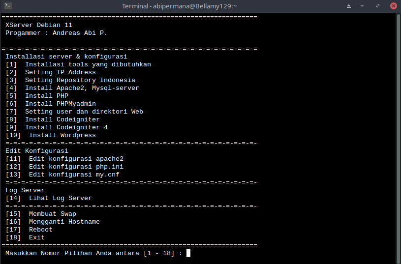

# XServer
XServer merupakan kode shell sederhana yang mengotomatisasi proses instalasi layanan web pada Server Debian 10.

Kode sederhana ini terinspirasi dari repository [X-Code pandawa](https://github.com/kurniawandata/x-code-pandawa-for-web) oleh [Kurniawan](https://github.com/kurniawandata)

## Penggunaan
```
$ git clone https://github.com/andreasabipermana/XServer.git
$ cd XServer
$ bash XServer.sh
```

## Fitur
- Instalasi Apache2
- Instalasi MariaDB
- Instalasi PHP
- Konfigurasi User dan Direktori Web
- Installer CodeIgniter 3 dan 4
- Installer Wordpress

## Tampilan
